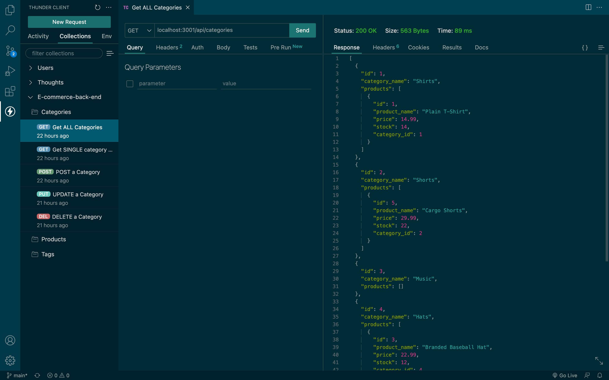
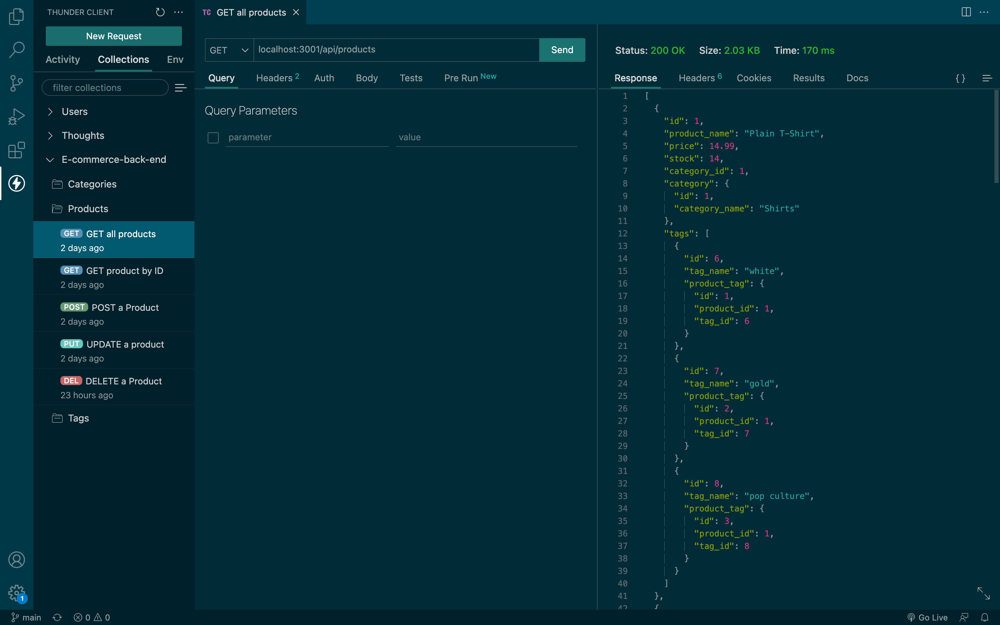
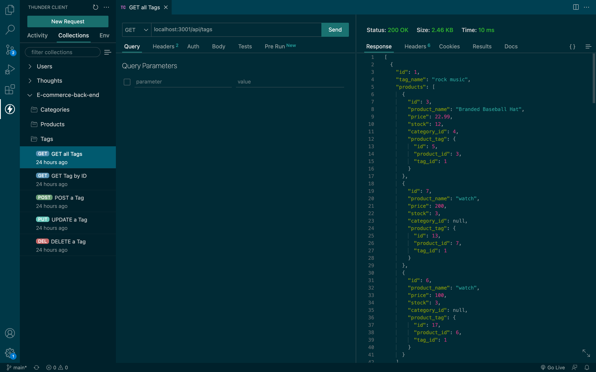

<h1 align="center"> <a href="https://youtu.be/6hiiLjYo2zg">
E-commerce Back End 🛍</a>
</h1>

<p align="center">This Project has no front end but cooperates and functions with MySQL and Sequelize.</p>

<p align="center"> For a Detailed Video Walkthrough you can follow the link in the Title of this one -> <a href= "https://youtu.be/6hiiLjYo2zg">Video Walkthrough</a></p>

## Table of Contents

- [Description](#description)

- [Installation](#installation)
- [Database Models](#database-models)
- [Usage](#usage)
- [Resources](#resources)
- [Questions](#questions)

## [License](table-of-contents)
### My project is under the following Licenses:
[](https://opensource.org/licenses/MIT)
## [Description](#table-of-contents)

Internet retail, also known as e-commerce, is the largest sector of the electronics industry, generating an estimated $29 trillion in 2019. E-commerce platforms like Shopify and WooCommerce provide a suite of services to businesses of all sizes. Since this is a back end application, we use applications like [Insomnia](https://insomnia.rest/), [Postman](https://www.postman.com/),  or [Thunder Client](https://www.thunderclient.com/) the application I will be using for this video walkthrough.

### User Story

```
AS A manager at an internet retail company
I WANT a back end for my e-commerce website that uses the latest technologies
SO THAT my company can compete with other e-commerce companies
```

### Acceptance Criteria

```md
GIVEN a functional Express.js API
WHEN I add my database name, MySQL username, and MySQL password to an environment variable file
THEN I am able to connect to a database using Sequelize
WHEN I enter schema and seed commands
THEN a development database is created and is seeded with test data
WHEN I enter the command to invoke the application
THEN my server is started and the Sequelize models are synced to the MySQL database
WHEN I open API GET routes in Insomnia for categories, products, or tags
THEN the data for each of these routes is displayed in a formatted JSON
WHEN I test API POST, PUT, and DELETE routes in Insomnia
THEN I am able to successfully create, update, and delete data in my database
```

## [Installation](#table-of-contents)
This application requires that you download the following packages using Node to run this application:

<p align="center">
 
<p align="center">
 
<p align="center">

<p align="center">

<p align="center">

<p align="center">

</p>

The NPM packages are on the package.json for you to simply run this command in your terminal to install the npm pakages needed:

```
npm i
```
once I have done that in order to run the application with Data already in the application i must first create my database and seed it with the sql files inside the DB folder

Below is a short GIF to help you understand exact steps for installation for a smooth application run:


once sql files have been sourced in MYSQL, and the seeds have been ran through npm, run the following command in your terminal

```
npm start
```
> Refer to the GIF above for visual instruction

## [Database Models](#table-of-contents)

* `Category`

  * `id`

    * Integer.
  
    * Doesn't allow null values.
  
    * Set as primary key.
  
    * Uses auto increment.

  * `category_name`
  
    * String.
  
    * Doesn't allow null values.

* `Product`

  * `id`
  
    * Integer.
  
    * Doesn't allow null values.
  
    * Set as primary key.
  
    * Uses auto increment.

  * `product_name`
  
    * String.
  
    * Doesn't allow null values.

  * `price`
  
    * Decimal.
  
    * Doesn't allow null values.
  
    * Validates that the value is a decimal.

  * `stock`
  
    * Integer.
  
    * Doesn't allow null values.
  
    * Set a default value of `10`.
  
    * Validates that the value is numeric.

  * `category_id`
  
    * Integer.
  
    * References the `Category` model's `id`.

* `Tag`

  * `id`
  
    * Integer.
  
    * Doesn't allow null values.
  
    * Set as primary key.
  
    * Uses auto increment.

  * `tag_name`
  
    * String.

* `ProductTag`

  * `id`

    * Integer.

    * Doesn't allow null values.

    * Set as primary key.

    * Uses auto increment.

  * `product_id`

    * Integer.

    * References the `Product` model's `id`.

  * `tag_id`

    * Integer.

    * References the `Tag` model's `id`.

## [Usage](#table-of-contents)

The following animation shows the application's **Category CRUD** routes tested in Thunder Client:



The following animation shows the application's **Product CRUD** routes tested in Thunder Client:



The following animation shows the application's **Tag CRUD** routes tested in Thunder Client:



## [Resources](#table-of-contents)

Using the My Sql DB application is a great resource for viewing models if a visual aspect of your models gives you a better prespective on how all the models end up connecting.

Below is an example of the models created using E-commerce back end models: 


## [Questions](#table-of-contents)

Take a look at some other work ive done on my repos from my Github:

* Github: [Lorena-RM](https://github.com/Lorena-RM)

Get in contact with me Directly within linkden or my personal email:

* Linkden: [Lorena Morales](https://www.linkedin.com/in/lorena-morales-496855240/)

* Email: [lorenarm.999@gmail.com](mailto:lorenarm.999@gmail.com)